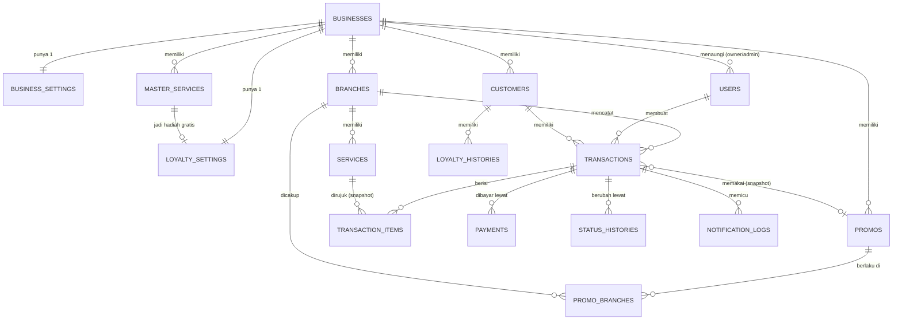

# Skema Database & ERD — CekLaundry

> **Kedudukan dokumen:** turunan teknis dari `prd.md` (khususnya Bagian 10) dan `architecture.md`. Jika ada pertentangan, `prd.md` menang. Nama tabel/kolom di sini adalah acuan implementasi migrasi; penambahan kolom teknis kecil diperbolehkan, penghapusan kolom di dokumen ini tidak.

Konvensi: MySQL 8.4, engine InnoDB, charset `utf8mb4`. Semua tabel memiliki `id BIGINT UNSIGNED AUTO_INCREMENT PRIMARY KEY` dan `created_at`/`updated_at` (kecuali disebut lain). Harga & uang = `INT UNSIGNED` (rupiah bulat). Berat = `DECIMAL(5,1)`. Waktu disimpan dalam zona Asia/Jakarta sesuai `APP_TIMEZONE`.

---

## 1. ERD (Entitas Utama)

---

## 2. Spesifikasi Tabel

### 2.1 `businesses` (tenant)

| Kolom | Tipe | Keterangan |
|---|---|---|
| `nama` | VARCHAR(150) | Nama bisnis laundry |
| `is_active` | BOOLEAN, default `true` | `false` = dinonaktifkan developer (login ditolak) |
| `active_until` | DATE, nullable | Wajib diisi untuk bisnis nyata (FR-D02), boleh null untuk demo; status AKTIF/TENGGANG/BACA_SAJA **dihitung**, tidak disimpan (lihat `architecture.md` Bagian 6) |
| `is_demo` | BOOLEAN, default `false` | Tenant demo (FR-M01) |
| `demo_expires_at` | DATETIME, nullable | Waktu penghapusan demo (FR-M05) |
| `wa_enabled` | BOOLEAN, default `false` | Saklar WA global bisnis (FR-D06) |
| `wa_provider` | ENUM('fonnte','wablas','waba'), nullable | Adapter penyedia |
| `wa_token` | TEXT, nullable | **Terenkripsi** (encrypted cast) |
| `wa_sender_number` | VARCHAR(20), nullable | Nomor pengirim resmi bisnis, format `62…` |
| `email_sender_name` | VARCHAR(100), nullable | Nama pengirim email |
| `email_sender_address` | VARCHAR(150), nullable | Alamat pengirim email |
| `smtp_config` | JSON, nullable | **Terenkripsi**; SMTP milik bisnis (opsional); null = SMTP global aplikasi |

### 2.2 `business_settings` (perilaku, diatur owner — 1:1)

| Kolom | Tipe | Keterangan |
|---|---|---|
| `business_id` | FK → businesses, **UNIQUE** | |
| `dp_enabled` | BOOLEAN, default `false` | Saklar "Terima uang muka" (FR-O07) |
| `reminder_enabled` | BOOLEAN, default `true` | FR-N02 |
| `reminder_first_days` | TINYINT UNSIGNED, default 2 | N; ≥1 saat pengingat aktif; juga ambang kartu menumpuk owner |
| `reminder_interval_days` | TINYINT UNSIGNED, default 2 | M; ≥1 saat pengingat aktif |
| `reminder_max_count` | TINYINT UNSIGNED, default 3 | K; ≥1 saat pengingat aktif |
| `wa_on_ready` | BOOLEAN, default `true` | Saklar WA peristiwa "Siap Diambil" (FR-O14) |
| `wa_on_reminder` | BOOLEAN, default `false` | Saklar WA peristiwa pengingat |
| `wa_monthly_limit` | INT UNSIGNED, nullable | Batas pesan WA/bulan; null = tanpa batas (FR-N04) |

### 2.3 `users`

| Kolom | Tipe | Keterangan |
|---|---|---|
| `business_id` | FK → businesses, nullable | Null hanya untuk `developer` |
| `branch_id` | FK → branches, nullable | Wajib untuk `admin`; null untuk lainnya |
| `nama` | VARCHAR(100) | |
| `email` | VARCHAR(150), **UNIQUE global** | Identitas login |
| `password` | VARCHAR(255) | Hash |
| `role` | ENUM('developer','owner','admin') | |
| `is_active` | BOOLEAN, default `true` | Nonaktif = login ditolak |
| `must_change_password` | BOOLEAN, default `false` | Dipaksa ganti saat login pertama (FR-D02/O01) |

Indeks: (`business_id`), (`branch_id`).

### 2.4 `branches`

| Kolom | Tipe | Keterangan |
|---|---|---|
| `business_id` | FK → businesses | |
| `nama` | VARCHAR(100) | Nama tempat |
| `alamat` | TEXT | |
| `telepon` | VARCHAR(20) | Format `62…` |
| `is_active` | BOOLEAN, default `true` | Tidak boleh `false` selama masih ada transaksi aktif (FR-O02, dijaga di service) |

Indeks: (`business_id`).

### 2.5 `master_services` (FR-O04)

| Kolom | Tipe | Keterangan |
|---|---|---|
| `business_id` | FK → businesses | |
| `nama` | VARCHAR(100) | Kunci pencocokan sinkronisasi |
| `satuan` | ENUM('kg','item') | |
| `harga` | INT UNSIGNED | Per satuan |
| `durasi_jam` | SMALLINT UNSIGNED | Untuk estimasi selesai |
| `berat_minimum` | DECIMAL(5,1), nullable | Hanya relevan satuan `kg` |
| `is_active` | BOOLEAN, default `true` | |

Constraint: **UNIQUE (`business_id`, `nama`)**.

### 2.6 `services` (layanan cabang, FR-O05)

Struktur atribut layanan identik `master_services`, dengan **`business_id` FK → businesses dan `branch_id` FK → branches**. `business_id` denormalisasi untuk scope tenant langsung; service mewajibkan `services.business_id = branches.business_id`.

Constraint: **UNIQUE (`branch_id`, `nama`)** — pencocokan nama dasar aturan timpa; FK komposit (`branch_id`, `business_id`) → `branches(id`, `business_id)`.

### 2.7 `customers`

| Kolom | Tipe | Keterangan |
|---|---|---|
| `business_id` | FK → businesses | Pelanggan lintas cabang dalam satu bisnis |
| `nama` | VARCHAR(100) | Boleh kembar antarpelanggan |
| `no_hp` | VARCHAR(20) | Format `62…` |
| `email` | VARCHAR(150), nullable | |
| `stamp_count` | INT SIGNED, default 0 | Cache `SUM(loyalty_histories.jumlah)`; boleh negatif hanya akibat pencabutan perolehan transaksi lama yang stempelnya sudah digunakan, bukan akibat penukaran baru |

Constraint: **UNIQUE (`business_id`, `no_hp`)** (FR-A13). Indeks: (`business_id`, `nama`).

### 2.8 `transactions`

| Kolom | Tipe | Keterangan |
|---|---|---|
| `business_id` | FK → businesses | Tenant transaksi; sama dengan tenant cabang dan customer |
| `kode_resi` | CHAR(6), **UNIQUE global** | Alfabet tanpa O/0/I/1/L (FR-R01) |
| `branch_id` | FK → branches | |
| `customer_id` | FK → customers | |
| `created_by` | FK → users | Pembuat (admin/owner) |
| `notification_email` | VARCHAR(150), nullable | Snapshot tujuan email transaksi; disalin dari customer saat dibuat, diperbarui bersama customer hanya oleh FR-C04 |
| `status` | ENUM('DITERIMA','DIPROSES','SIAP_DIAMBIL','SUDAH_DIAMBIL','DIBATALKAN'), default 'DITERIMA' | Bagian 6 `prd.md` |
| `waktu_masuk` | DATETIME | |
| `estimasi_selesai` | DATETIME | Otomatis, dapat dikoreksi (7.3) |
| `waktu_siap_diambil` | DATETIME, nullable | Diisi saat → SIAP_DIAMBIL |
| `waktu_diambil` | DATETIME, nullable | Diisi saat → SUDAH_DIAMBIL |
| `subtotal` | INT UNSIGNED | Jumlah subtotal item |
| `potongan_stempel` | INT UNSIGNED, default 0 | 7.2 |
| `promo_id` | FK → promos, nullable | Referensi (boleh menggantung ke promo nonaktif) |
| `promo_nama_snapshot` | VARCHAR(100), nullable | Snapshot (FR-P03) |
| `promo_tipe_snapshot` | ENUM('persen','nominal'), nullable | Snapshot |
| `promo_nilai_snapshot` | INT UNSIGNED, nullable | Snapshot |
| `potongan_promo` | INT UNSIGNED, default 0 | Hasil hitung 7.2 |
| `total_akhir` | INT UNSIGNED | ≥ 0 |
| `status_bayar` | ENUM('BELUM_BAYAR','DP','LUNAS') | Cache turunan dari `total_akhir` dan `payments`; total Rp0 = `LUNAS` tanpa payment. Saat create wajib dihitung, jangan mengandalkan default `BELUM_BAYAR` |
| `catatan_kondisi` | TEXT, nullable | FR-A04 |
| `alasan_pembatalan` | TEXT, nullable | Wajib terisi bila DIBATALKAN |
| `reminder_count` | TINYINT UNSIGNED, default 0 | Cache nomor pengingat terakhir yang direservasi; sumber idempotensi = `notification_logs` |
| `last_reminder_at` | DATETIME, nullable | Cache waktu reservasi pengingat terakhir untuk interval M |

Indeks: UNIQUE (`kode_resi`); UNIQUE (`id`, `business_id`) untuk FK child komposit; (`business_id`, `branch_id`, `status`); (`business_id`, `status`, `waktu_siap_diambil`) — daftar menumpuk & pengingat (`waktu_siap_diambil <= waktu_sekarang - reminder_first_days hari`); (`business_id`, `customer_id`); (`business_id`, `branch_id`, `waktu_masuk`). FK komposit (`branch_id`, `business_id`) → `branches(id`, `business_id)` dan (`customer_id`, `business_id`) → `customers(id`, `business_id)`.

### 2.9 `transaction_items`

| Kolom | Tipe | Keterangan |
|---|---|---|
| `transaction_id` | FK → transactions | |
| `service_id` | FK → services, nullable | Referensi opsional; data tampil memakai snapshot; tenant/cabang service divalidasi saat membuat item |
| `nama_layanan_snapshot` | VARCHAR(100) | FR pada 7.1 butir 5 |
| `satuan_snapshot` | ENUM('kg','item') | |
| `harga_snapshot` | INT UNSIGNED | |
| `berat_kg` | DECIMAL(5,1), nullable | Terisi untuk satuan `kg` |
| `jumlah_unit` | SMALLINT UNSIGNED, nullable | Terisi untuk satuan `item` |
| `perkiraan_jumlah_baju` | SMALLINT UNSIGNED, nullable | Informasi opsional (FR-A03) |
| `is_stamp_reward` | BOOLEAN, default `false` | Item yang menerima potongan stempel (FR-L03) |
| `subtotal` | INT UNSIGNED | Hasil final snapshot, sudah memperhitungkan berat minimum saat transaksi dibuat |

Indeks: (`transaction_id`).

### 2.10 `payments` (7.4 — **tidak pernah di-UPDATE/DELETE**)

| Kolom | Tipe | Keterangan |
|---|---|---|
| `business_id` | FK → businesses | Tenant pembayaran, sama dengan transaksi |
| `transaction_id` | FK → transactions | |
| `jumlah` | INT UNSIGNED | > 0; total per transaksi ≤ `total_akhir` (dijaga `PaymentService`) |
| `metode` | ENUM('tunai','transfer') | |
| `waktu` | DATETIME | Basis laporan pendapatan (7.5) |
| `recorded_by` | FK → users | |
| `created_at` | DATETIME | Tanpa `updated_at` — baris permanen |

Indeks: (`business_id`, `transaction_id`); (`business_id`, `waktu`) — laporan pendapatan. FK komposit (`transaction_id`, `business_id`) → `transactions(id`, `business_id)`.

### 2.11 `promos` (FR-P01)

| Kolom | Tipe | Keterangan |
|---|---|---|
| `business_id` | FK → businesses | |
| `nama` | VARCHAR(100) | |
| `tipe` | ENUM('persen','nominal') | |
| `nilai` | INT UNSIGNED | Persen 1–100, atau rupiah |
| `minimal_total` | INT UNSIGNED, nullable | Dibandingkan dengan `promo_eligible_base = subtotal - potongan_stempel`, bukan total sebelum stempel |
| `mulai` | DATE | |
| `selesai` | DATE | |
| `semua_cabang` | BOOLEAN, default `true` | Bila `false`, lihat `promo_branches` |
| `is_active` | BOOLEAN, default `true` | |

### 2.12 `promo_branches` (pivot)

`promo_id` FK + `branch_id` FK, **PRIMARY KEY komposit** (`promo_id`,`branch_id`). Tanpa timestamps.

### 2.13 `loyalty_settings` (FR-L01 — 1:1)

| Kolom | Tipe | Keterangan |
|---|---|---|
| `business_id` | FK → businesses, **UNIQUE** | |
| `is_active` | BOOLEAN, default `false` | |
| `stempel_dibutuhkan` | TINYINT UNSIGNED, default 10 | N; saat aktif wajib ≥ 1 |
| `master_service_id` | FK → master_services, nullable | Layanan gratis (satuan `kg`) |
| `berat_maks_gratis` | DECIMAL(5,1), nullable, default null | Saat aktif wajib > 0 |

`master_service_id` default null. Saat bisnis dibuat, satu row nonaktif dibuat walau hadiah belum diisi. Aktivasi memvalidasi master service satuan `kg` dari bisnis yang sama.

### 2.14 `loyalty_histories` (FR-L02–L04)

| Kolom | Tipe | Keterangan |
|---|---|---|
| `business_id` | FK → businesses | Sama dengan tenant customer dan transaksi terkait |
| `customer_id` | FK → customers | |
| `transaction_id` | FK → transactions, nullable | |
| `jenis` | ENUM('perolehan','penukaran','pengembalian_penukaran','pencabutan_perolehan') | Peristiwa ledger append-only |
| `jumlah` | INT SIGNED | Delta aktual saat event: +1, −N, +N yang dahulu ditukar, −1; tidak pernah dihitung ulang dengan N terkini |
| `created_at` | DATETIME | Tanpa `updated_at` |

Indeks: (`business_id`, `customer_id`), (`transaction_id`, `jenis`). FK komposit customer/transaksi + business; `transaction_id` boleh null hanya untuk entry yang memang tidak terkait transaksi bila kelak dibutuhkan, seluruh empat peristiwa saat ini terkait transaksi. Constraint `jumlah <> 0` dan tanda wajib cocok dengan `jenis`; per transaksi hanya satu `penukaran`, satu `pengembalian_penukaran`, satu `perolehan`, satu `pencabutan_perolehan` (unique `transaction_id`, `jenis`).

### 2.15 `status_histories`

`business_id` FK → businesses, `transaction_id` FK → transactions, `status` ENUM (sama dengan transaksi), `user_id` FK → users nullable (null = sistem), `created_at`. Tanpa `updated_at`. Indeks: (`business_id`, `transaction_id`). FK komposit transaksi + business.

### 2.16 `notification_logs` (FR-N05)

| Kolom | Tipe | Keterangan |
|---|---|---|
| `business_id` | FK → businesses | Denormalisasi tenant, sama dengan transaksi |
| `transaction_id` | FK → transactions | |
| `kanal` | ENUM('email','whatsapp','whatsapp_manual') | `whatsapp` = API otomatis, `whatsapp_manual` = pembukaan `wa.me` |
| `tipe` | ENUM('siap_diambil','pengingat','resi') | `resi` untuk link manual FR-A09 |
| `reminder_number` | TINYINT UNSIGNED, nullable | 0 untuk siap-diambil otomatis, 1..K untuk pengingat otomatis; null untuk manual |
| `notification_key` | VARCHAR(150), nullable, UNIQUE | Key deterministik otomatis dari transaction ID, tipe, kanal, reminder_number; null untuk setiap aksi manual |
| `tujuan` | VARCHAR(150) | Alamat email / nomor WA |
| `status` | ENUM('tertunda','diproses','berhasil','gagal','dilewati_batas','ditekan_demo','dibuka_manual','perlu_pemeriksaan') | `diproses` = worker sudah mengklaim key; `dibuka_manual` tidak berarti terkirim; `perlu_pemeriksaan` untuk hasil penyedia tidak pasti |
| `attempt_count` | TINYINT UNSIGNED, default 0 | Jumlah percobaan otomatis pada key yang sama, maksimal 3 |
| `created_at`, `updated_at` | DATETIME | Satu baris per key otomatis; status/attempt pada baris sama diperbarui saat retry |

Indeks: UNIQUE (`notification_key`) (MySQL membolehkan banyak null untuk manual); (`business_id`, `kanal`, `status`, `created_at`) — penghitung WA otomatis yang berhasil; (`business_id`, `transaction_id`). FK komposit transaksi + business. Reservasi key/nomor pengingat atomik. Worker mengklaim baris dari `tertunda` secara atomik menjadi `diproses`; worker kedua yang melihat `diproses`/status terminal tidak mengirim. Kegagalan yang pasti dapat mengantre ulang key sama hingga 3 percobaan; timeout dengan hasil tidak pasti masuk `perlu_pemeriksaan`, tanpa retry kirim buta. `notification_logs` adalah sumber kebenaran pengiriman; tidak ada `notified_ready_at`.

### 2.17 `audit_logs`

Untuk aksi berisiko yang wajib tercatat (penggabungan pelanggan FR-A14, sinkronisasi master FR-O05, perubahan masa aktif FR-D03, reset password).

| Kolom | Tipe | Keterangan |
|---|---|---|
| `business_id` | FK → businesses, nullable | Null hanya untuk aksi developer yang tidak terikat tenant tertentu; aksi pada bisnis tertentu memakai ID bisnis tersebut |
| `user_id` | FK → users | Pelaku |
| `aksi` | VARCHAR(100) | mis. `pelanggan.gabung`, `layanan.sinkron_master` |
| `detail` | JSON | Data sebelum/sesudah seperlunya |
| `created_at` | DATETIME | Tanpa `updated_at` |

### 2.18 Tabel infrastruktur Laravel

`jobs`, `failed_jobs`, `job_batches`, `password_reset_tokens`, `sessions`, `cache` — memakai migrasi bawaan Laravel tanpa perubahan.

---

## 3. Foreign Key, Penghapusan, dan Integritas

**Relasi tenant.** Kolom `business_id` non-null pada data operasional utama: `branches`, `master_services`, `services`, `customers`, `transactions`, `payments`, `promos`, `loyalty_settings`, `loyalty_histories`, `status_histories`, dan `notification_logs`. `business_settings` juga non-null; `users` null hanya bagi developer, `audit_logs` null hanya untuk aksi developer tanpa tenant tertentu. `transaction_items` mengambil tenant dari transaksi; `promo_branches` dari promo dan cabang. `services.business_id = branches.business_id`; `transactions.business_id = branches.business_id = customers.business_id`; `payments`, `status_histories`, `notification_logs`, dan `loyalty_histories` harus sama dengan tenant parent; `users.branch_id` (admin), `promo_branches`, `loyalty_settings.master_service_id`, serta `transactions.promo_id` harus merujuk record tenant yang sama. Validasi ini wajib di service/application layer dan diuji otomatis.

**FK penguat.** Tambahkan UNIQUE (`id`, `business_id`) pada `branches`, `customers`, `services`, `master_services`, `promos`, dan `transactions` agar FK komposit child + tenant dapat dibuat di MySQL. Gunakan FK komposit untuk `services→branches`, `transactions→branches/customers`, `payments/status_histories/notification_logs/loyalty_histories→transactions`, dan `loyalty_histories→customers`. FK sederhana tetap ada untuk business root. Untuk `users.branch_id`, `promo_branches`, `loyalty_settings.master_service_id`, dan `transactions.promo_id`, service memeriksa tenant/cabang karena FK nullable atau pivot tidak selalu cocok untuk FK komposit; pengujian otomatis membuktikan ID lintas tenant ditolak. Admin dibatasi cabangnya saat baca dan tulis.

**ON DELETE.** Semua FK ke `businesses` memakai `RESTRICT` selama tenant normal masih memiliki data. FK dari histori `payments`, `status_histories`, `loyalty_histories`, `notification_logs`, `audit_logs`, dan transaksi ke parent operasional memakai `RESTRICT`; tidak ada cascade-delete histori. `transaction_items.transaction_id` juga `RESTRICT`. Referensi snapshot opsional `transaction_items.service_id` dan `transactions.promo_id` boleh `SET NULL` pada hard delete master, meskipun UI normal hanya menonaktifkan master lewat `is_active`; snapshot tetap tampil. Akun/cabang/customer yang direferensikan histori dinonaktifkan/dipertahankan; hard delete normal ditolak oleh FK `RESTRICT`. Merge customer adalah operasi khusus yang terlebih dahulu memindahkan seluruh FK transaksi dan `loyalty_histories.customer_id` ke target satu bisnis, lalu menghapus source. Pemindahan FK kepemilikan ini satu-satunya update metadata ledger yang diizinkan; `jenis`, `jumlah`, `transaction_id`, dan `created_at` tidak berubah. Tidak ada cascade delete bisnis normal.

| FK anak → induk | `ON DELETE` | Alasan |
|---|---|---|
| Semua `business_id` → `businesses.id` (termasuk yang nullable) | `RESTRICT` | Tenant normal tidak hilang ketika masih punya data |
| `users.branch_id`, `services.branch_id`, `transactions.branch_id`, `promo_branches.branch_id` → `branches.id` | `RESTRICT` | Cabang dinonaktifkan, bukan dihapus saat masih dirujuk |
| `transactions.customer_id`, `loyalty_histories.customer_id` → `customers.id` | `RESTRICT` | Merge harus memindahkan FK sebelum menghapus source |
| `transactions.created_by`, `payments.recorded_by`, `status_histories.user_id`, `audit_logs.user_id` → `users.id` | `RESTRICT` | Pelaku historis tetap dapat dilacak |
| `transaction_items.transaction_id`, `payments.transaction_id`, `status_histories.transaction_id`, `notification_logs.transaction_id`, `loyalty_histories.transaction_id` → `transactions.id` | `RESTRICT` | Histori transaksi tetap utuh |
| `transaction_items.service_id` → `services.id`; `transactions.promo_id` → `promos.id` | `SET NULL` | Tampilan historis memakai snapshot, bila master benar-benar dihapus |
| `loyalty_settings.master_service_id` → `master_services.id`; `promo_branches.promo_id` → `promos.id` | `RESTRICT` | Konfigurasi/pivot diubah atau dinonaktifkan secara eksplisit |

FK komposit memakai perilaku hapus yang sama dengan FK sederhana relasinya. FK `business_settings`/`loyalty_settings` ke business dan `promo_branches` ke branch mengikuti baris terkait di tabel ini. Tidak ada `ON DELETE CASCADE` pada data bisnis.

**Purge demo.** Satu-satunya penghapusan permanen seluruh tenant adalah command/service pembersihan demo FR-M05. Command memverifikasi `is_demo`, menghapus child sebelum parent dalam transaksi terkontrol (termasuk log dan tabel pengaturan), lalu business; tidak mengandalkan FK cascade dan dapat diulang tanpa menggandakan efek. Data histori demo ikut terhapus sebagai pengecualian retensi.

**Invarian service/application layer.**

1. `payments` tambah-saja, jumlah >0, kumulatif ≤ `total_akhir`; `PaymentService` mengunci transaksi `FOR UPDATE`, menghitung ulang sisa, memasukkan payment, menurunkan status, memproses stempel, lalu commit. Total Rp0 langsung `LUNAS` tanpa payment.
2. Transisi status hanya maju sesuai peta; `SUDAH_DIAMBIL` mensyaratkan `LUNAS`; `DIBATALKAN` wajib alasan. Edit field harga hanya saat `DITERIMA` tanpa payment/penukaran; edit catatan/estimasi saat `DITERIMA`; sejak `DIPROSES` tidak ada edit operasional. FR-C04 secara khusus dapat mengubah `notification_email` dan `customers.email` sebelum `SIAP_DIAMBIL` pada tenant yang dapat menulis.
3. `loyalty_histories` tambah-saja dengan delta aktual bertanda; saldo = `SUM(jumlah)` dan `customers.stamp_count` diperbarui atomik. Penukaran memakai lock customer dan menolak saldo tak cukup. Pembatalan menambah entry kompensasi sekali; perubahan N tidak mengubah ledger lama.
4. `branches.is_active` tidak boleh dimatikan bila masih ada transaksi aktif. Penggabungan customer mempertahankan identitas target dan menghitung ulang saldo dari ledger gabungan.
5. Notifikasi otomatis memakai `notification_key` unik per transaksi/tipe/kanal/nomor; `reminder_count` dan `last_reminder_at` hanya cache jadwal. Log manual `wa.me` berstatus `dibuka_manual`, bukan `berhasil`. Retry kanal tidak menggandakan kiriman yang sudah sukses.
