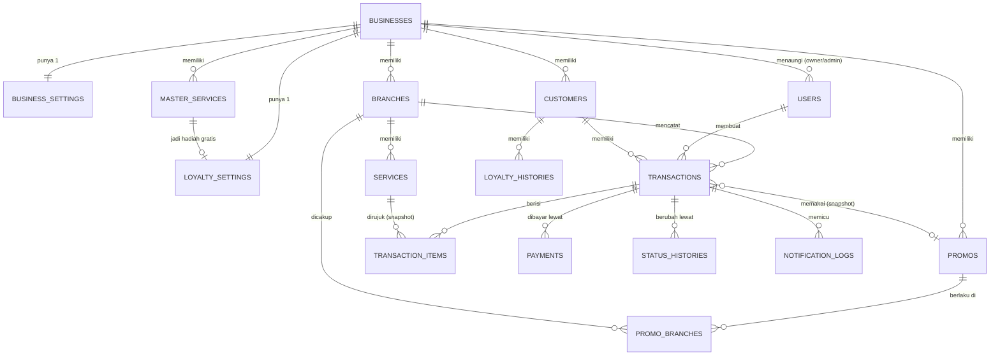

# Skema Database & ERD — CekLaundry

> **Kedudukan dokumen:** turunan teknis dari `prd.md` (khususnya Bagian 10) dan `architecture.md`. Jika ada pertentangan, `prd.md` menang. Nama tabel/kolom di sini adalah acuan implementasi migrasi; penambahan kolom teknis kecil diperbolehkan, penghapusan kolom di dokumen ini tidak.

Konvensi: MySQL 8.4, engine InnoDB, charset `utf8mb4`. Semua tabel memiliki `id BIGINT UNSIGNED AUTO_INCREMENT PRIMARY KEY` dan `created_at`/`updated_at` (kecuali disebut lain). Harga & uang = `INT UNSIGNED` (rupiah bulat). Berat = `DECIMAL(5,1)`. Waktu disimpan dalam zona Asia/Jakarta sesuai `APP_TIMEZONE`.

---

## 1. ERD (Entitas Utama)

---

## 2. Spesifikasi Tabel

### 2.1 `businesses` (tenant)

| Kolom | Tipe | Keterangan |
|---|---|---|
| `nama` | VARCHAR(150) | Nama bisnis laundry |
| `is_active` | BOOLEAN, default `true` | `false` = dinonaktifkan developer (login ditolak) |
| `active_until` | DATE, nullable | Masa aktif; status AKTIF/TENGGANG/BACA_SAJA **dihitung**, tidak disimpan (lihat `architecture.md` Bagian 6) |
| `is_demo` | BOOLEAN, default `false` | Tenant demo (FR-M01) |
| `demo_expires_at` | DATETIME, nullable | Waktu penghapusan demo (FR-M05) |
| `wa_enabled` | BOOLEAN, default `false` | Saklar WA global bisnis (FR-D06) |
| `wa_provider` | ENUM('fonnte','wablas','waba'), nullable | Adapter penyedia |
| `wa_token` | TEXT, nullable | **Terenkripsi** (encrypted cast) |
| `wa_sender_number` | VARCHAR(20), nullable | Nomor pengirim resmi bisnis, format `62…` |
| `email_sender_name` | VARCHAR(100), nullable | Nama pengirim email |
| `email_sender_address` | VARCHAR(150), nullable | Alamat pengirim email |
| `smtp_config` | JSON, nullable | **Terenkripsi**; SMTP milik bisnis (opsional); null = SMTP global aplikasi |

### 2.2 `business_settings` (perilaku, diatur owner — 1:1)

| Kolom | Tipe | Keterangan |
|---|---|---|
| `business_id` | FK → businesses, **UNIQUE** | |
| `dp_enabled` | BOOLEAN, default `false` | Saklar "Terima uang muka" (FR-O07) |
| `reminder_enabled` | BOOLEAN, default `true` | FR-N02 |
| `reminder_first_days` | TINYINT UNSIGNED, default 2 | N |
| `reminder_interval_days` | TINYINT UNSIGNED, default 2 | M |
| `reminder_max_count` | TINYINT UNSIGNED, default 3 | K |
| `wa_on_ready` | BOOLEAN, default `true` | Saklar WA peristiwa "Siap Diambil" (FR-O14) |
| `wa_on_reminder` | BOOLEAN, default `false` | Saklar WA peristiwa pengingat |
| `wa_monthly_limit` | INT UNSIGNED, nullable | Batas pesan WA/bulan; null = tanpa batas (FR-N04) |

### 2.3 `users`

| Kolom | Tipe | Keterangan |
|---|---|---|
| `business_id` | FK → businesses, nullable | Null hanya untuk `developer` |
| `branch_id` | FK → branches, nullable | Wajib untuk `admin`; null untuk lainnya |
| `nama` | VARCHAR(100) | |
| `email` | VARCHAR(150), **UNIQUE global** | Identitas login |
| `password` | VARCHAR(255) | Hash |
| `role` | ENUM('developer','owner','admin') | |
| `is_active` | BOOLEAN, default `true` | Nonaktif = login ditolak |
| `must_change_password` | BOOLEAN, default `false` | Dipaksa ganti saat login pertama (FR-D02/O01) |

Indeks: (`business_id`), (`branch_id`).

### 2.4 `branches`

| Kolom | Tipe | Keterangan |
|---|---|---|
| `business_id` | FK → businesses | |
| `nama` | VARCHAR(100) | Nama tempat |
| `alamat` | TEXT | |
| `telepon` | VARCHAR(20) | Format `62…` |
| `is_active` | BOOLEAN, default `true` | Tidak boleh `false` selama masih ada transaksi aktif (FR-O02, dijaga di service) |

Indeks: (`business_id`).

### 2.5 `master_services` (FR-O04)

| Kolom | Tipe | Keterangan |
|---|---|---|
| `business_id` | FK → businesses | |
| `nama` | VARCHAR(100) | Kunci pencocokan sinkronisasi |
| `satuan` | ENUM('kg','item') | |
| `harga` | INT UNSIGNED | Per satuan |
| `durasi_jam` | SMALLINT UNSIGNED | Untuk estimasi selesai |
| `berat_minimum` | DECIMAL(5,1), nullable | Hanya relevan satuan `kg` |
| `is_active` | BOOLEAN, default `true` | |

Constraint: **UNIQUE (`business_id`, `nama`)**.

### 2.6 `services` (layanan cabang, FR-O05)

Struktur identik `master_services` dengan `branch_id` FK → branches menggantikan `business_id`.

Constraint: **UNIQUE (`branch_id`, `nama`)** — pencocokan nama inilah dasar aturan timpa "Salin/Perbarui dari Master".

### 2.7 `customers`

| Kolom | Tipe | Keterangan |
|---|---|---|
| `business_id` | FK → businesses | Pelanggan lintas cabang dalam satu bisnis |
| `nama` | VARCHAR(100) | Boleh kembar antarpelanggan |
| `no_hp` | VARCHAR(20) | Format `62…` |
| `email` | VARCHAR(150), nullable | |
| `stamp_count` | INT UNSIGNED, default 0 | Penghitung stempel (denormalisasi; sumber kebenaran = `loyalty_histories`, dijaga konsisten dalam transaksi DB) |

Constraint: **UNIQUE (`business_id`, `no_hp`)** (FR-A13). Indeks: (`business_id`, `nama`).

### 2.8 `transactions`

| Kolom | Tipe | Keterangan |
|---|---|---|
| `kode_resi` | CHAR(6), **UNIQUE global** | Alfabet tanpa O/0/I/1/L (FR-R01) |
| `branch_id` | FK → branches | |
| `customer_id` | FK → customers | |
| `created_by` | FK → users | Pembuat (admin/owner) |
| `status` | ENUM('DITERIMA','DIPROSES','SIAP_DIAMBIL','SUDAH_DIAMBIL','DIBATALKAN'), default 'DITERIMA' | Bagian 6 `prd.md` |
| `waktu_masuk` | DATETIME | |
| `estimasi_selesai` | DATETIME | Otomatis, dapat dikoreksi (7.3) |
| `waktu_siap_diambil` | DATETIME, nullable | Diisi saat → SIAP_DIAMBIL |
| `waktu_diambil` | DATETIME, nullable | Diisi saat → SUDAH_DIAMBIL |
| `subtotal` | INT UNSIGNED | Jumlah subtotal item |
| `potongan_stempel` | INT UNSIGNED, default 0 | 7.2 |
| `promo_id` | FK → promos, nullable | Referensi (boleh menggantung ke promo nonaktif) |
| `promo_nama_snapshot` | VARCHAR(100), nullable | Snapshot (FR-P03) |
| `promo_tipe_snapshot` | ENUM('persen','nominal'), nullable | Snapshot |
| `promo_nilai_snapshot` | INT UNSIGNED, nullable | Snapshot |
| `potongan_promo` | INT UNSIGNED, default 0 | Hasil hitung 7.2 |
| `total_akhir` | INT UNSIGNED | ≥ 0 |
| `status_bayar` | ENUM('BELUM_BAYAR','DP','LUNAS'), default 'BELUM_BAYAR' | **Turunan** dari `payments`, dihitung ulang oleh `PaymentService` (7.4) |
| `catatan_kondisi` | TEXT, nullable | FR-A04 |
| `alasan_pembatalan` | TEXT, nullable | Wajib terisi bila DIBATALKAN |
| `notified_ready_at` | DATETIME, nullable | Penjaga sekali-kirim FR-N01 |
| `reminder_count` | TINYINT UNSIGNED, default 0 | Penghitung K (FR-N02) |
| `last_reminder_at` | DATETIME, nullable | Penjaga interval M |

Indeks: UNIQUE (`kode_resi`); (`branch_id`, `status`); (`status`, `waktu_siap_diambil`) — daftar menumpuk & pengingat; (`customer_id`); (`branch_id`, `waktu_masuk`) — laporan & dashboard harian.

### 2.9 `transaction_items`

| Kolom | Tipe | Keterangan |
|---|---|---|
| `transaction_id` | FK → transactions | |
| `service_id` | FK → services, nullable | Referensi; data tampil memakai snapshot |
| `nama_layanan_snapshot` | VARCHAR(100) | FR pada 7.1 butir 5 |
| `satuan_snapshot` | ENUM('kg','item') | |
| `harga_snapshot` | INT UNSIGNED | |
| `berat_kg` | DECIMAL(5,1), nullable | Terisi untuk satuan `kg` |
| `jumlah_unit` | SMALLINT UNSIGNED, nullable | Terisi untuk satuan `item` |
| `perkiraan_jumlah_baju` | SMALLINT UNSIGNED, nullable | Informasi opsional (FR-A03) |
| `is_stamp_reward` | BOOLEAN, default `false` | Item yang menerima potongan stempel (FR-L03) |
| `subtotal` | INT UNSIGNED | Sudah memperhitungkan berat minimum |

Indeks: (`transaction_id`).

### 2.10 `payments` (7.4 — **tidak pernah di-UPDATE/DELETE**)

| Kolom | Tipe | Keterangan |
|---|---|---|
| `transaction_id` | FK → transactions | |
| `jumlah` | INT UNSIGNED | > 0; total per transaksi ≤ `total_akhir` (dijaga `PaymentService`) |
| `metode` | ENUM('tunai','transfer') | |
| `waktu` | DATETIME | Basis laporan pendapatan (7.5) |
| `recorded_by` | FK → users | |
| `created_at` | DATETIME | Tanpa `updated_at` — baris permanen |

Indeks: (`transaction_id`); (`waktu`) — laporan pendapatan per periode.

### 2.11 `promos` (FR-P01)

| Kolom | Tipe | Keterangan |
|---|---|---|
| `business_id` | FK → businesses | |
| `nama` | VARCHAR(100) | |
| `tipe` | ENUM('persen','nominal') | |
| `nilai` | INT UNSIGNED | Persen 1–100, atau rupiah |
| `minimal_total` | INT UNSIGNED, nullable | Validasi FR-P02 |
| `mulai` | DATE | |
| `selesai` | DATE | |
| `semua_cabang` | BOOLEAN, default `true` | Bila `false`, lihat `promo_branches` |
| `is_active` | BOOLEAN, default `true` | |

### 2.12 `promo_branches` (pivot)

`promo_id` FK + `branch_id` FK, **PRIMARY KEY komposit** (`promo_id`,`branch_id`). Tanpa timestamps.

### 2.13 `loyalty_settings` (FR-L01 — 1:1)

| Kolom | Tipe | Keterangan |
|---|---|---|
| `business_id` | FK → businesses, **UNIQUE** | |
| `is_active` | BOOLEAN, default `false` | |
| `stempel_dibutuhkan` | TINYINT UNSIGNED | N |
| `master_service_id` | FK → master_services, nullable | Layanan gratis (satuan `kg`) |
| `berat_maks_gratis` | DECIMAL(5,1), nullable | |

### 2.14 `loyalty_histories` (FR-L02–L04)

| Kolom | Tipe | Keterangan |
|---|---|---|
| `customer_id` | FK → customers | |
| `transaction_id` | FK → transactions, nullable | |
| `jenis` | ENUM('perolehan','penukaran','pencabutan') | |
| `jumlah` | SMALLINT UNSIGNED | Selalu positif; arah ditentukan `jenis` |
| `created_at` | DATETIME | Tanpa `updated_at` |

Indeks: (`customer_id`).

### 2.15 `status_histories`

`transaction_id` FK, `status` ENUM (sama dengan transaksi), `user_id` FK → users nullable (null = sistem), `created_at`. Tanpa `updated_at`. Indeks: (`transaction_id`).

### 2.16 `notification_logs` (FR-N05)

| Kolom | Tipe | Keterangan |
|---|---|---|
| `business_id` | FK → businesses | **Denormalisasi** untuk penghitung WA bulanan yang cepat |
| `transaction_id` | FK → transactions | |
| `kanal` | ENUM('email','whatsapp') | |
| `tipe` | ENUM('siap_diambil','pengingat') | |
| `tujuan` | VARCHAR(150) | Alamat email / nomor WA |
| `status` | ENUM('berhasil','gagal','dilewati_batas','ditekan_demo') | |
| `created_at` | DATETIME | Tanpa `updated_at` |

Indeks: (`business_id`, `kanal`, `status`, `created_at`) — kueri penghitung bulanan; (`transaction_id`).

### 2.17 `audit_logs`

Untuk aksi berisiko yang wajib tercatat (penggabungan pelanggan FR-A14, sinkronisasi master FR-O05, perubahan masa aktif FR-D03, reset password).

| Kolom | Tipe | Keterangan |
|---|---|---|
| `business_id` | FK → businesses, nullable | Null untuk aksi lintas-tenant developer |
| `user_id` | FK → users | Pelaku |
| `aksi` | VARCHAR(100) | mis. `pelanggan.gabung`, `layanan.sinkron_master` |
| `detail` | JSON | Data sebelum/sesudah seperlunya |
| `created_at` | DATETIME | Tanpa `updated_at` |

### 2.18 Tabel infrastruktur Laravel

`jobs`, `failed_jobs`, `job_batches`, `password_reset_tokens`, `sessions`, `cache` — memakai migrasi bawaan Laravel tanpa perubahan.

---

## 3. Aturan Integritas yang Dijaga di Lapisan Aplikasi

Hal-hal berikut **tidak** diekspresikan sebagai constraint database dan wajib dijaga oleh service (lihat `architecture.md` Bagian 7 & 14):

1. `payments` bersifat tambah-saja; jumlah kumulatif ≤ `total_akhir`; DP hanya saat `dp_enabled` aktif.
2. Transisi `status` transaksi hanya maju sesuai peta; `SUDAH_DIAMBIL` mensyaratkan `status_bayar = LUNAS`; `DIBATALKAN` wajib beralasan.
3. Edit transaksi hanya saat `DITERIMA`.
4. `stamp_count` pelanggan selalu = penjumlahan `loyalty_histories` (perolehan − penukaran×N − pencabutan), diperbarui dalam satu transaksi DB.
5. `branches.is_active` tidak boleh dimatikan bila masih ada transaksi berstatus aktif.
6. Penghapusan tenant demo (FR-M05) menghapus seluruh baris terkait bisnis tersebut di semua tabel (cascade lewat perintah pembersihan, bukan FK cascade, agar terkontrol dan teraudit).
7. Semua kueri operasional melewati global scope `business_id`; `notification_logs.business_id` diisi dari transaksi terkait.
