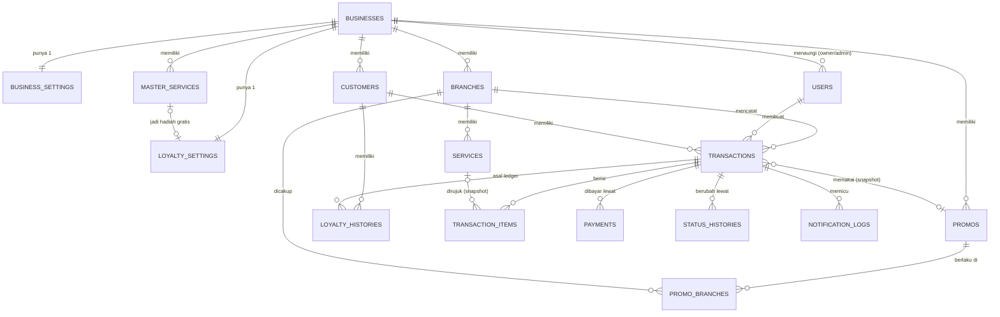

# Skema Database & ERD — CekLaundry

> **Kedudukan dokumen:** turunan teknis dari `prd.md` (khususnya Bagian 10) dan `architecture.md`. Jika ada pertentangan, `prd.md` menang. Nama tabel/kolom di sini adalah acuan implementasi migrasi; penambahan kolom teknis kecil diperbolehkan, penghapusan kolom di dokumen ini tidak.

Konvensi: MySQL 8.4, engine InnoDB, charset `utf8mb4`. Semua tabel memiliki `id BIGINT UNSIGNED AUTO_INCREMENT PRIMARY KEY` dan `created_at`/`updated_at` (kecuali disebut lain). Harga & uang = `INT UNSIGNED` (rupiah bulat). Berat = `DECIMAL(5,1)`. Waktu DATETIME disimpan dalam WIB (PHP Asia/Jakarta dan session MySQL +07:00); infra Laravel tetap epoch sesuai migrasi framework. Default collation `utf8mb4_0900_as_ci` (case-insensitive, accent-sensitive); kode/UUID/hash memakai ASCII binary. Semua FK memakai BIGINT UNSIGNED dan ON UPDATE RESTRICT. Angka uang dihitung dengan integer 64-bit sebelum validasi range INT UNSIGNED; SUM laporan/ledger memakai accumulator lebar, bukan INT32.

---

## 1. ERD (Entitas Utama)

---

## 2. Spesifikasi Tabel

### 2.1 `businesses` (tenant)

| Kolom | Tipe | Keterangan |
|---|---|---|
| `nama` | VARCHAR(150) | Nama bisnis laundry |
| `is_active` | BOOLEAN, default `true` | `false` = dinonaktifkan developer (login ditolak) |
| `active_until` | DATE, nullable | Wajib diisi untuk bisnis nyata (FR-D02), boleh null untuk demo; status AKTIF/TENGGANG/BACA_SAJA **dihitung**, tidak disimpan (lihat `architecture.md` Bagian 2) |
| `is_demo` | BOOLEAN, default `false` | Tenant demo (FR-M01) |
| `demo_expires_at` | DATETIME, nullable | Waktu kedaluwarsa tepat7hari, purge≤5menit setelahnya pada sistem sehat (FR-M05) |
| `wa_enabled` | BOOLEAN, default `false` | Saklar WA global bisnis (FR-D06) |
| `wa_provider` | ENUM('fonnte','wablas','waba'), nullable | Adapter penyedia |
| `wa_config` | TEXT, nullable | encrypted:array; object per provider sesuai architecture 6.3, default null; wajib lengkap saat WA aktif nyata |
| `wa_token` | TEXT, nullable | **Terenkripsi** (encrypted cast) |
| `wa_sender_number` | VARCHAR(20), nullable | Nomor pengirim resmi bisnis, format `62…` |
| `email_sender_name` | VARCHAR(100), nullable | Nama pengirim email |
| `email_sender_address` | VARCHAR(150), nullable | Alamat pengirim email |
| `smtp_config` | TEXT, nullable | **Terenkripsi** via encrypted:array, bukan SQL JSON; SMTP milik bisnis (opsional); null = SMTP global aplikasi |

### 2.2 `business_settings` (perilaku, diatur owner — 1:1)

| Kolom | Tipe | Keterangan |
|---|---|---|
| `business_id` | FK → businesses, **UNIQUE** | |
| `dp_enabled` | BOOLEAN, default `false` | Izin partial payment pertama saat payment dicatat (FR-O07); dibaca sesudah business root lock. DP berjalan boleh dicicil/dilunasi saat false; bukan snapshot transaksi |
| `reminder_enabled` | BOOLEAN, default `true` | FR-N02 |
| `reminder_first_days` | TINYINT UNSIGNED, default 2 | N; 1–255 selalu, termasuk pengingat mati; juga ambang kartu menumpuk owner |
| `reminder_interval_days` | TINYINT UNSIGNED, default 2 | M; 1–255 selalu |
| `reminder_max_count` | TINYINT UNSIGNED, default 3 | K; 1–255 selalu |
| `wa_on_ready` | BOOLEAN, default `true` | Saklar WA peristiwa "Siap Diambil" (FR-O14) |
| `wa_on_reminder` | BOOLEAN, default `false` | Saklar WA peristiwa pengingat |
| `wa_monthly_limit` | INT UNSIGNED, nullable | Batas slot bulan kuota WIB; null tanpa batas, 0 tidak ada slot; perubahan di bawah occupied bulan kini ditolak (FR-N04) |

### 2.3 `users`

| Kolom | Tipe | Keterangan |
|---|---|---|
| `business_id` | FK → businesses, nullable | Null hanya untuk `developer` |
| `branch_id` | FK → branches, nullable | Wajib untuk `admin`; null untuk lainnya |
| `nama` | VARCHAR(100) | |
| `email` | VARCHAR(150), **UNIQUE global** | Identitas login |
| `password` | VARCHAR(255) | Hash |
| `role` | ENUM('developer','owner','admin') | |
| `is_active` | BOOLEAN, default `true` | Nonaktif = login ditolak |
| `must_change_password` | BOOLEAN, default `false` | Dipaksa ganti saat login pertama (FR-D02/O01) |

Indeks: (`business_id`), (`branch_id`), UNIQUE (`id`, `business_id`). Tambahkan `owner_business_id BIGINT UNSIGNED GENERATED ALWAYS AS (CASE WHEN role = 'owner' THEN business_id ELSE NULL END) STORED`, UNIQUE (`owner_business_id`), untuk maksimal satu owner/tenant. Provision menjamin tepat satu. CHECK role: developer memiliki business/branch null; owner business non-null dan branch null; admin keduanya non-null. FK komposit (`branch_id`,`business_id`) → branches(id,business_id), RESTRICT. Email canonical trim/lowercase. Tidak ada remember-me; sessions database dan password_reset_tokens memakai migrasi framework.

### 2.4 `branches`

| Kolom | Tipe | Keterangan |
|---|---|---|
| `business_id` | FK → businesses | |
| `nama` | VARCHAR(100) | Nama tempat |
| `alamat` | TEXT | |
| `telepon` | VARCHAR(20) | Format `62…` |
| `is_active` | BOOLEAN, default `true` | Tidak boleh `false` selama masih ada transaksi aktif (FR-O02, dijaga di service) |

Indeks: (`business_id`).

### 2.5 `master_services` (FR-O04)

| Kolom | Tipe | Keterangan |
|---|---|---|
| `business_id` | FK → businesses | |
| `nama` | VARCHAR(100) | Kunci pencocokan sinkronisasi |
| `satuan` | ENUM('kg','item') | |
| `harga` | INT UNSIGNED | Per satuan |
| `durasi_jam` | SMALLINT UNSIGNED | Untuk estimasi selesai |
| `berat_minimum` | DECIMAL(5,1), nullable | Hanya relevan satuan `kg` |
| `is_active` | BOOLEAN, default `true` | |

Constraint: **UNIQUE (`business_id`, `nama`)**.

### 2.6 `services` (layanan cabang, FR-O05)

Struktur atribut layanan identik `master_services`, dengan **`business_id` FK → businesses dan `branch_id` FK → branches**. `business_id` denormalisasi untuk scope tenant langsung; service mewajibkan `services.business_id = branches.business_id`.

Constraint: **UNIQUE (`branch_id`, `nama`)** — pencocokan nama dasar aturan timpa; FK komposit (`branch_id`, `business_id`) → `branches(id`, `business_id)`.

### 2.7 `customers`

| Kolom | Tipe | Keterangan |
|---|---|---|
| `business_id` | FK → businesses | Pelanggan lintas cabang dalam satu bisnis |
| `nama` | VARCHAR(100) | Boleh kembar antarpelanggan |
| `no_hp` | VARCHAR(20) | Format `62…` |
| `email` | VARCHAR(150), nullable | |
| `stamp_count` | INT SIGNED, default 0 | Cache `SUM(loyalty_histories.jumlah)`; boleh negatif hanya akibat pencabutan perolehan transaksi lama yang stempelnya sudah digunakan, bukan akibat penukaran baru |

Constraint: **UNIQUE (`business_id`, `no_hp`)** (FR-A13). Indeks: (`business_id`, `nama`).

### 2.8 `transactions`

| Kolom | Tipe | Keterangan |
|---|---|---|
| `business_id` | FK → businesses | Tenant transaksi; sama dengan tenant cabang dan customer |
| `kode_resi` | CHAR(6), **UNIQUE global** | Alfabet tanpa O/0/I/1/L (FR-R01) |
| `branch_id` | FK → branches | |
| `customer_id` | FK → customers | |
| `created_by` | FK → users | Pembuat (admin/owner) |
| `notification_email` | VARCHAR(150), nullable | Email aktif transaksi; disalin dari master customer (tidak mengklaim terverifikasi); FR-C04 terverifikasi hanya mengubah kolom ini, tidak master |
| `pending_notification_email` | VARCHAR(150), nullable | Calon email dari form publik; belum dipakai untuk notifikasi operasional; tidak pernah disalin ke customer oleh endpoint publik |
| `email_verification_version` | INT UNSIGNED, default 0 | Dinaikkan setiap permintaan FR-C04; tautan bertanda tangan mengikat versi terbaru |
| `email_verification_expires_at` | DATETIME, nullable | 24 jam setelah permintaan; pending/tautan lama tidak berlaku setelah lewat waktu |
| `version` | BIGINT UNSIGNED, default 1 | Versi optimistic concurrency; setiap unit mutasi transaksi setelah create menaikkan satu kali |
| `create_request_key` | CHAR(36) ASCII binary | UUID aksi create; unik per business |
| `create_request_hash` | CHAR(64) ASCII binary | SHA-256 input create kanonis; replay key dengan payload berbeda ditolak |
| `stamp_reward_max_kg_snapshot` | DECIMAL(5,1), nullable | Maks berat hadiah saat redemption; null jika tidak menukar, N aktual tersimpan sebagai delta ledger |
| `status` | ENUM('DITERIMA','DIPROSES','SIAP_DIAMBIL','SUDAH_DIAMBIL','DIBATALKAN'), default 'DITERIMA' | Bagian 6 `prd.md` |
| `waktu_masuk` | DATETIME | |
| `estimasi_selesai` | DATETIME | Otomatis, dapat dikoreksi (7.3) |
| `waktu_siap_diambil` | DATETIME, nullable | Diisi saat → SIAP_DIAMBIL |
| `waktu_diambil` | DATETIME, nullable | Diisi saat → SUDAH_DIAMBIL |
| `subtotal` | INT UNSIGNED | Jumlah subtotal item |
| `potongan_stempel` | INT UNSIGNED, default 0 | 7.2 |
| `promo_id` | FK → promos, nullable | Referensi (boleh menggantung ke promo nonaktif) |
| `promo_nama_snapshot` | VARCHAR(100), nullable | Snapshot (FR-P03) |
| `promo_tipe_snapshot` | ENUM('persen','nominal'), nullable | Snapshot |
| `promo_nilai_snapshot` | INT UNSIGNED, nullable | Snapshot |
| `potongan_promo` | INT UNSIGNED, default 0 | Hasil hitung 7.2 |
| `total_akhir` | INT UNSIGNED | ≥ 0 |
| `status_bayar` | ENUM('BELUM_BAYAR','DP','LUNAS') | Cache turunan dari `total_akhir` dan `payments`; total Rp0 = `LUNAS` tanpa payment. Saat create wajib dihitung, jangan mengandalkan default `BELUM_BAYAR` |
| `catatan_kondisi` | TEXT, nullable | FR-A04 |
| `alasan_pembatalan` | TEXT, nullable | Wajib terisi bila DIBATALKAN |
| `reminder_count` | TINYINT UNSIGNED, default 0 | Cursor jadwal nomor pengingat terakhir direservasi; tidak pernah reset, bukan hitungan sukses; idempotensi per kanal di notification_logs |
| `last_reminder_at` | DATETIME, nullable | Waktu reservasi nomor terakhir untuk interval M; null iff reminder_count=0 |

Indeks: UNIQUE (`business_id`, `create_request_key`); UNIQUE (`kode_resi`); UNIQUE (`id`, `business_id`) untuk FK child komposit; (`business_id`, `branch_id`, `status`); (`business_id`, `status`, `waktu_siap_diambil`) — daftar menumpuk & pengingat (`waktu_siap_diambil <= waktu_sekarang - reminder_first_days hari`); (`business_id`, `customer_id`); (`business_id`, `branch_id`, `waktu_masuk`); (`business_id`, `waktu_masuk`); (`business_id`, `branch_id`, `status`, `estimasi_selesai`). FK komposit (`branch_id`, `business_id`) → `branches(id`, `business_id)` dan (`customer_id`, `business_id`) → `customers(id`, `business_id)`.

### 2.9 `transaction_items`

| Kolom | Tipe | Keterangan |
|---|---|---|
| `transaction_id` | FK → transactions | |
| `service_id` | FK → services, nullable | Referensi opsional; data tampil memakai snapshot; tenant/cabang service divalidasi saat membuat item |
| `nama_layanan_snapshot` | VARCHAR(100) | FR pada 7.1 butir 5 |
| `satuan_snapshot` | ENUM('kg','item') | |
| `harga_snapshot` | INT UNSIGNED | |
| `berat_minimum_snapshot` | DECIMAL(5,1), nullable | Minimum harga saat save finansial; null untuk item/tanpa minimum |
| `durasi_jam_snapshot` | SMALLINT UNSIGNED | Durasi saat save finansial; positif untuk estimasi yang dapat direproduksi |
| `berat_kg` | DECIMAL(5,1), nullable | Terisi untuk satuan `kg` |
| `jumlah_unit` | SMALLINT UNSIGNED, nullable | Terisi untuk satuan `item` |
| `perkiraan_jumlah_baju` | SMALLINT UNSIGNED, nullable | Informasi opsional (FR-A03) |
| `is_stamp_reward` | BOOLEAN, default `false` | Item yang menerima potongan stempel (FR-L03) |
| `subtotal` | INT UNSIGNED | Hasil final snapshot, sudah memperhitungkan berat minimum saat transaksi dibuat |

Indeks: (`transaction_id`). CHECK kuantitas: kg → berat_kg >0, jumlah_unit null; item → jumlah_unit >0, berat_kg dan berat_minimum_snapshot null. CHECK harga_snapshot>0, durasi_jam_snapshot>0, minimum null atau>0. Maksimum satu is_stamp_reward per transaksi dijaga service; hadiah wajib kg.

### 2.10 `payments` (7.4 — **tidak pernah di-UPDATE/DELETE**)

| Kolom | Tipe | Keterangan |
|---|---|---|
| `business_id` | FK → businesses | Tenant pembayaran, sama dengan transaksi |
| `transaction_id` | FK → transactions | |
| `request_key` | CHAR(36) ASCII binary | UUID aksi pembayaran, termasuk key deterministik payment awal |
| `request_hash` | CHAR(64) ASCII binary | Hash payload kanonis untuk deteksi replay berbeda |
| `jumlah` | INT UNSIGNED | > 0; total per transaksi ≤ `total_akhir` (dijaga `PaymentService`) |
| `metode` | ENUM('tunai','transfer') | |
| `waktu` | DATETIME | Jam server saat pencatatan; basis laporan pendapatan (7.5), bukan input backdate |
| `recorded_by` | FK → users | |
| `created_at` | DATETIME | Tanpa `updated_at` — baris permanen |

Indeks: UNIQUE (`business_id`,`request_key`); (`business_id`, `transaction_id`); (`business_id`, `waktu`) — laporan pendapatan. FK komposit (`transaction_id`, `business_id`) → `transactions(id`, `business_id)`.

### 2.11 `promos` (FR-P01)

| Kolom | Tipe | Keterangan |
|---|---|---|
| `business_id` | FK → businesses | |
| `nama` | VARCHAR(100) | |
| `tipe` | ENUM('persen','nominal') | |
| `nilai` | INT UNSIGNED | Persen 1–100, atau rupiah |
| `minimal_total` | INT UNSIGNED, nullable | Dibandingkan dengan `promo_eligible_base = subtotal - potongan_stempel`, bukan total sebelum stempel |
| `mulai` | DATE | |
| `selesai` | DATE | |
| `semua_cabang` | BOOLEAN, default `true` | Bila `false`, lihat `promo_branches` |
| `is_active` | BOOLEAN, default `true` | |

### 2.12 `promo_branches` (pivot)

`promo_id` FK + `branch_id` FK (keduanya non-null), **PRIMARY KEY komposit** (`promo_id`,`branch_id`). Tanpa id tunggal/timestamps; tenant diwarisi kedua parent dan wajib sama melalui service.

### 2.13 `loyalty_settings` (FR-L01 — 1:1)

| Kolom | Tipe | Keterangan |
|---|---|---|
| `business_id` | FK → businesses, **UNIQUE** | |
| `is_active` | BOOLEAN, default `false` | |
| `stempel_dibutuhkan` | TINYINT UNSIGNED, default 10 | N; 1–255, termasuk konfigurasi nonaktif |
| `master_service_id` | FK → master_services, nullable | Layanan gratis (satuan `kg`) |
| `berat_maks_gratis` | DECIMAL(5,1), nullable, default null | Saat aktif wajib > 0 |

`master_service_id` default null. Saat bisnis dibuat, satu row nonaktif dibuat walau hadiah belum diisi. Aktivasi memvalidasi master service aktif satuan `kg` dari bisnis yang sama.

### 2.14 `loyalty_histories` (FR-L02–L04)

| Kolom | Tipe | Keterangan |
|---|---|---|
| `business_id` | FK → businesses | Sama dengan tenant customer dan transaksi terkait |
| `customer_id` | FK → customers | |
| `transaction_id` | FK → transactions, NOT NULL | Semua jenis ledger saat ini wajib transaksi asal |
| `jenis` | ENUM('perolehan','penukaran','pengembalian_penukaran','pencabutan_perolehan') | Peristiwa ledger append-only |
| `jumlah` | INT SIGNED | Delta aktual saat event: +1, −N, +N yang dahulu ditukar, −1; tidak pernah dihitung ulang dengan N terkini |
| `created_at` | DATETIME | Tanpa `updated_at` |

Indeks: (`business_id`, `customer_id`), (`transaction_id`, `jenis`). FK komposit customer/transaksi + business; `transaction_id` tidak boleh null; tidak menyiapkan jenis ledger di luar scope. CHECK perolehan=+1, pencabutan_perolehan=−1, penukaran<0, pengembalian_penukaran>0; per transaksi hanya satu `penukaran`, satu `pengembalian_penukaran`, satu `perolehan`, satu `pencabutan_perolehan` (unique `transaction_id`, `jenis`).

### 2.15 `status_histories`

`business_id` FK → businesses, `transaction_id` FK → transactions, `status` ENUM (sama dengan transaksi), `user_id` FK → users nullable (null = sistem), `created_at`. Tanpa `updated_at`. Indeks: (`business_id`, `transaction_id`), UNIQUE (`transaction_id`,`status`). FK komposit transaksi + business. Ada history DITERIMA awal; timestamps/actor server. Tidak ada riwayat ganda untuk retry state sama.

### 2.16 `notification_logs` (FR-N05)

| Kolom | Tipe | Keterangan |
|---|---|---|
| `business_id` | FK → businesses | Sama dengan transaksi |
| `transaction_id` | FK → transactions, NOT NULL | Parent dan sumber branch |
| `kanal` | ENUM('email','whatsapp','whatsapp_manual') | whatsapp hanya API; manual bukan bukti terkirim |
| `tipe` | ENUM('siap_diambil','pengingat','resi','verifikasi_email') | Tipe pesan |
| `requested_by` | FK → users, nullable | Wajib aksi manual panel, null otomatis/publik; actor saat request, tenant/cabang divalidasi |
| `is_manual` | BOOLEAN, default false | Membedakan reminder manual dari otomatis; whatsapp_manual wajib true |
| `reminder_number` | TINYINT UNSIGNED, nullable | Ready otomatis 0, pengingat otomatis 1..255, selain itu null |
| `verification_version` | INT UNSIGNED, nullable | Hanya tipe verifikasi_email; dibandingkan dengan transaksi sebelum send |
| `notification_key` | VARCHAR(150) ASCII binary, NOT NULL UNIQUE | Format arsitektur 6.1; manual UUID juga non-null |
| `request_hash` | CHAR(64) ASCII binary, nullable | Wajib untuk aksi manual, hash input kanonis; replay berbeda→409 |
| `tujuan` | VARCHAR(150), NOT NULL | Destination email/WA; WA otomatis nonterminal yang belum pernah attempt mengikuti nomor terbaru/target secara atomik (arsitektur 6.2.1). Email, histori terminal dan WA pernah attempt tetap snapshot; tidak ada kolom destination kedua |
| `status` | ENUM('tertunda','diproses','berhasil','gagal','dilewati_batas','dilewati_kondisi','ditekan_demo','dibuka_manual','perlu_pemeriksaan') | State machine arsitektur 6.2 |
| `reason_code` | VARCHAR(64), nullable | Kode alasan aman mis. status_berubah/tenant_readonly/bulan_retry_berubah/recipient_berubah/restore_hold/restore_cutoff; bukan raw exception |
| `attempt_count` | TINYINT UNSIGNED, default 0 | CHECK 0..3, jumlah otorisasi panggilan provider, bukan claim; monoton, tidak direset saat marker/claim dikosongkan |
| `processing_token` | CHAR(36) ASCII binary, nullable | Claim/finalisasi CAS; invalidasi pada reclaim, retarget sebelum attempt, review recipient/restore; token dicabut tidak boleh finalize termasuk accepted terlambat |
| `processing_started_at` | DATETIME, nullable | Awal lease 5 menit |
| `delivery_started_at` | DATETIME, nullable | Marker tepat sebelum panggilan; setelah commit marker, crash dianggap unknown. Null tidak membuktikan belum pernah attempt; never_attempted hanya bila null DAN attempt_count=0 |
| `next_attempt_at` | DATETIME, nullable | Wajib saat tertunda; due awal now atau backoff60/300detik |
| `last_enqueued_at` | DATETIME, nullable | Waktu enqueue atomik terakhir, recovery pending lebih dari5menit |
| `payload_snapshot` | JSON, nullable | Freeze sebelum panggilan pertama: template, kode_resi, nama/info cabang, total_akhir, sisa_tagihan, status_url; verifikasi memakai versi/expiry. provider_options berisi konfigurasi request nonrahasia sesuai architecture 6.2 agar retry stabil. Tidak menyimpan credential/signature; URL signed dirender dari metadata saat send |
| `provider_name_snapshot` | ENUM('smtp','fonnte','wablas','waba'), nullable | Jenis provider panggilan pertama; tanpa token/config rahasia |
| `wa_quota_month` | DATE, nullable | Tanggal1 bulan otorisasi pertama WIB; pending dapat dipindah sebelum attempt pertama; immutable setelah attempt>0 |
| `sent_at` | DATETIME, nullable | Waktu aplikasi mencatat provider accepted; bukan dasar pemindahan bucket kuota |
| `created_at`, `updated_at` | DATETIME | Satu row/key sepanjang umur transaksi |

Indeks: UNIQUE notification_key; (`business_id`,`kanal`,`wa_quota_month`,`status`); (`status`,`next_attempt_at`,`last_enqueued_at`); (`status`,`processing_started_at`); (`business_id`,`transaction_id`); (`business_id`,`requested_by`,`created_at`). FK komposit transaction+business RESTRICT. Constraint bentuk: verification_version hanya/wajib verifikasi; nomor hanya/wajib ready/reminder otomatis; is_manual+kanal/tipe valid; whatsapp_manual hanya tipe resi/pengingat dan status dibuka_manual/ditekan_demo. wa_quota_month hanya untuk whatsapp; sent_at hanya/wajib berhasil; diproses wajib token/start; delivery marker membutuhkan attempt>0. Log verifikasi dan email operasional terpisah.

Log+jobs dibuat pada transaksi/koneksi DB yang sama. Slot WA occupied pada status tertunda/diproses/berhasil/perlu_pemeriksaan; failed/skipped/demo/manual tidak dihitung. Semua mutasi kuota di bawah business lock. Unknown terminal tidak melepas slot, definite retry same key tidak mengambil slot ganda. Counter sukses owner menurut wa_quota_month, bukan sent_at. Retensi semua identity/log sepanjang transaksi; tidak ada pruning yang memungkinkan send ulang.

Retarget WA never_attempted mempertahankan notification_key/reminder_number/created_at dan slot; claim lama dibatalkan dan enqueue ID sama atomik. Pernah attempt + nomor berubah →perlu_pemeriksaan dengan recipient_berubah, snapshot/attempt/bucket tetap dan token dicabut; hasil lama tidak menimpa review. Restore hold/cutoff juga memakai status perlu_pemeriksaan existing, dapat attempt_count=0 karena state backup tidak membuktikan outcome eksternal; bukan klaim pernah terkirim. Terminal historis tidak diretarget. Guard dan transisi berada di service, bukan CHECK lintas tabel.

Review schema terfokus: snapshot izin DP dihapus dari transactions. Tidak ada field pengganti, flag pernah-attempt, kolom destination, enum, CHECK, unique constraint, atau indeks baru. Indeks transactions(business_id,customer_id) dan notification_logs(business_id,transaction_id) cukup untuk penelusuran log edit/merge; UNIQUE notification_key tetap. `OUTBOUND_RESTORE_HOLD` dan `outbound_resume_at` merupakan konfigurasi deployment di luar backup DB; filter memakai created_at log dan waktu_siap_diambil transaksi existing. Kontrak restore/RPO di PRD 9.2.1 dan arsitektur9.

### 2.17 `audit_logs`

Untuk aksi berisiko yang wajib tercatat (penggabungan pelanggan FR-A14, **pembatalan transaksi FR-A15**, sinkronisasi master FR-O05, perubahan masa aktif FR-D03, reset password). `CancellationService` menulis pelaku dan alasan pembatalan ke `audit_logs` dalam transaksi DB yang sama dengan perubahan status dan kompensasi stempel.

| Kolom | Tipe | Keterangan |
|---|---|---|
| `business_id` | FK → businesses, nullable | Null hanya untuk aksi developer yang tidak terikat tenant tertentu; aksi pada bisnis tertentu memakai ID bisnis tersebut |
| `user_id` | FK → users | Pelaku |
| `aksi` | VARCHAR(100) | mis. `pelanggan.gabung`, `layanan.sinkron_master` |
| `detail` | JSON | Data sebelum/sesudah seperlunya |
| `created_at` | DATETIME | Tanpa `updated_at` |

### 2.18 Tabel infrastruktur Laravel

`jobs`, `failed_jobs`, `job_batches`, `password_reset_tokens`, `sessions`, `cache`, `cache_locks` memakai migrasi bawaan Laravel. Tidak mempunyai business_id domain; tidak diakses melalui endpoint operasional. Job transaksi hanya business_id+log_id; metadata JSON top-level business_id ditulis server. Auth reset job memakai payload terenkripsi user_id/recipient/token/expiry sesuai architecture 6.4; tidak tampil di panel developer. Failed exception sanitized. Sessions menyimpan ID user dan metadata pasangan demo server untuk pencabutan saat purge. Job batch tidak diperlukan untuk domain ini; tabel bawaan boleh ada. Queue memakai koneksi MySQL yang sama, after_commit=false. Cache/rate-limit keys tenant/identity di-hash; lock infra tidak ditahan saat mengambil business lock.

---

## 3. Foreign Key, Penghapusan, dan Integritas

**Relasi tenant.** Kolom `business_id` non-null pada data operasional utama: `branches`, `master_services`, `services`, `customers`, `transactions`, `payments`, `promos`, `loyalty_settings`, `loyalty_histories`, `status_histories`, dan `notification_logs`. `business_settings` juga non-null; `users` null hanya bagi developer, `audit_logs` null hanya untuk aksi developer tanpa tenant tertentu. `transaction_items` mengambil tenant dari transaksi; `promo_branches` dari promo dan cabang. `services.business_id = branches.business_id`; `transactions.business_id = branches.business_id = customers.business_id`; `payments`, `status_histories`, `notification_logs`, dan `loyalty_histories` harus sama dengan tenant parent; `users.branch_id` (admin), `promo_branches`, `loyalty_settings.master_service_id`, serta `transactions.promo_id` harus merujuk record tenant yang sama. Validasi ini wajib di service/application layer dan diuji otomatis.

**FK penguat.** Tambahkan UNIQUE (`id`, `business_id`) pada `branches`, `customers`, `services`, `master_services`, `promos`, dan `transactions` agar FK komposit child + tenant dapat dibuat di MySQL. Gunakan FK komposit untuk `services→branches`, `transactions→branches/customers`, `payments/status_histories/notification_logs/loyalty_histories→transactions`, dan `loyalty_histories→customers`. FK sederhana tetap ada untuk business root. Gunakan juga FK komposit users(branch_id,business_id)→branches dan loyalty_settings(master_service_id,business_id)→master_services, ON DELETE RESTRICT; nullable FK diperbolehkan MySQL. Pivot promo_branches dan item.service_id mengambil tenant dari parent sehingga kesamaan tenant/cabang wajib divalidasi service. transactions.promo_id memakai FK sederhana SET NULL agar penghapusan referensi snapshot tidak mencoba men-null-kan business_id non-null; service memvalidasi tenant. Actor FK sederhana divalidasi tenant/role/cabang saat event. Semua jalur ini memiliki uji negatif lintas tenant. Admin dibatasi cabangnya saat baca dan tulis.

**ON DELETE.** Semua FK ke `businesses` memakai `RESTRICT` selama tenant normal masih memiliki data. FK dari histori `payments`, `status_histories`, `loyalty_histories`, `notification_logs`, `audit_logs`, dan transaksi ke parent operasional memakai `RESTRICT`; tidak ada cascade-delete histori. `transaction_items.transaction_id` juga `RESTRICT`. Referensi snapshot opsional `transaction_items.service_id` dan `transactions.promo_id` boleh `SET NULL` pada hard delete master, meskipun UI normal hanya menonaktifkan master lewat `is_active`; snapshot tetap tampil. Akun/cabang dinonaktifkan dan customer dipertahankan (customer tidak memiliki is_active); hard delete normal ditolak oleh FK `RESTRICT`. Merge customer adalah operasi khusus yang terlebih dahulu memindahkan seluruh FK transaksi dan `loyalty_histories.customer_id` ke target satu bisnis, lalu menghapus source. Pemindahan FK kepemilikan ini satu-satunya update metadata ledger yang diizinkan; `jenis`, `jumlah`, `transaction_id`, dan `created_at` tidak berubah. Tidak ada cascade delete bisnis normal.

| FK anak → induk | `ON DELETE` | Alasan |
|---|---|---|
| Semua `business_id` → `businesses.id` (termasuk yang nullable) | `RESTRICT` | Tenant normal tidak hilang ketika masih punya data |
| `users.branch_id`, `services.branch_id`, `transactions.branch_id`, `promo_branches.branch_id` → `branches.id` | `RESTRICT` | Cabang dinonaktifkan, bukan dihapus saat masih dirujuk |
| `transactions.customer_id`, `loyalty_histories.customer_id` → `customers.id` | `RESTRICT` | Merge harus memindahkan FK sebelum menghapus source |
| `transactions.created_by`, `payments.recorded_by`, `status_histories.user_id`, `audit_logs.user_id`, `notification_logs.requested_by` → `users.id` | `RESTRICT` | Pelaku historis tetap dapat dilacak |
| `transaction_items.transaction_id`, `payments.transaction_id`, `status_histories.transaction_id`, `notification_logs.transaction_id`, `loyalty_histories.transaction_id` → `transactions.id` | `RESTRICT` | Histori transaksi tetap utuh |
| `transaction_items.service_id` → `services.id`; `transactions.promo_id` → `promos.id` | `SET NULL` | Tampilan historis memakai snapshot, bila master benar-benar dihapus |
| `loyalty_settings.master_service_id` → `master_services.id`; `promo_branches.promo_id` → `promos.id` | `RESTRICT` | Konfigurasi/pivot diubah atau dinonaktifkan secara eksplisit |

FK komposit memakai perilaku hapus yang sama dengan FK sederhana relasinya. FK `business_settings`/`loyalty_settings` ke business dan `promo_branches` ke branch mengikuti baris terkait di tabel ini. Tidak ada `ON DELETE CASCADE` pada data bisnis.

**Purge demo.** Satu-satunya penghapusan permanen seluruh tenant adalah command/service pembersihan demo FR-M05. Command memverifikasi `is_demo`, menghapus child sebelum parent dalam transaksi terkontrol (termasuk log dan tabel pengaturan), lalu business; tidak mengandalkan FK cascade dan dapat diulang tanpa menggandakan efek. Data histori demo ikut terhapus sebagai pengecualian retensi.

**Invarian service/application layer.**

1. `payments` tambah-saja, jumlah >0, kumulatif ≤ `total_akhir`; `PaymentService` mengikuti business→customer→transaction lock `FOR UPDATE`, membaca business_settings.dp_enabled serta SUM payment terkini, menghitung ulang sisa, memasukkan payment, menurunkan status, memproses stempel, lalu commit. Untuk total>0, pembayaran penuh sah; partial pertama (SUM=0) memerlukan saklar true, cicilan DP berjalan (0<SUM<total) boleh meski false. Toggle mengambil root lock yang sama; replay payment existing tidak dievaluasi sebagai payment baru. Total Rp0 langsung `LUNAS` tanpa payment.
2. Transisi status hanya maju sesuai peta; `SUDAH_DIAMBIL` mensyaratkan `LUNAS`; `DIBATALKAN` wajib alasan/audit. Edit field harga hanya saat `DITERIMA` belum LUNAS tanpa payment **dan tanpa entry `loyalty_histories` apa pun pada transaksi**; edit catatan/estimasi saat `DITERIMA`; sejak `DIPROSES` tidak ada edit operasional. FR-C04 lebih dulu mengisi pending; hanya POST konfirmasi email sah pada status `DITERIMA`/`DIPROSES` yang dapat mengubah `notification_email` transaksi, tidak `customers.email` pada tenant yang dapat menulis. Transisi ke siap/batal dan merge customer sumber menghapus pending serta menaikkan versi agar tautan lama tidak berlaku.
3. `loyalty_histories` tambah-saja dengan delta aktual bertanda; saldo = `SUM(jumlah)` dan `customers.stamp_count` diperbarui atomik. Penukaran memakai lock customer dan menolak saldo tak cukup. Pembatalan menambah entry kompensasi sekali; perubahan N tidak mengubah ledger lama.
4. `branches.is_active` tidak boleh dimatikan bila masih ada transaksi aktif. Penggabungan customer mempertahankan identitas target dan menghitung ulang saldo dari ledger gabungan. Edit nomor/merge juga menyesuaikan log WA menurut arsitektur6.2.1 dalam unit yang sama; source dihapus terakhir, nomor lama bebas setelah commit, email transaksi tetap snapshot. Pemeliharaan log seluruh cabang customer bersama tidak mengekspos transaksi cabang lain kepada admin.
5. Notifikasi otomatis memakai `notification_key` unik per transaksi/tipe/kanal/nomor; verifikasi email memakai versi permintaan. `reminder_count` dan `last_reminder_at` cursor jadwal persisten. Log manual `wa.me` berstatus `dibuka_manual`, bukan `berhasil`. Reservasi log+job atomik, lease worker dapat dipulihkan secara aman, dan reservasi slot WA di bawah lock bisnis menjaga batas bulanan saat request paralel. Preflight/retry/recovery memeriksa recipient customer terkini serta restore hold/cutoff sebelum call; slot review tidak dilepas berdasarkan dugaan.

## 4. Constraints dan nilai turunan yang wajib

- Semua field pada tabel domain non-null kecuali ditandai nullable; settings per bisnis UNIQUE dan diprovision tepat satu. Tenant normal active_until non-null/demo_expires_at null; demo expiry non-null. CHECK role user dan unique owner pada2.3. Boolean hanya 0/1.
- CHECK layanan/master harga>0, durasi_jam>0; kg minimum null atau>0; item minimum null. Nama trim/collapse spaces sebelum save, UNIQUE memakai collation yang sama dengan matching hadiah. Quantity/berat/harga/totals range PRD 7.8, maksimal100 items di service. Total/potongan dihitung dalam INT64 agar overflow ditolak sebelum insert. Promo: persen1..100/nominal>0, mulai<=selesai, minimal_total null atau≥0; sebagian cabang harus punya pivot bisnis sama (service).
- CHECK subtotal≥potongan_stempel dan subtotal−potongan_stempel≥potongan_promo, total_akhir=subtotal−potongan_stempel−potongan_promo. Semua promo snapshot null dan potongan0 bila tanpa promo; snapshot nama/tipe/nilai lengkap bila pernah memakai promo meskipun FK kemudian null. Hadiah: maksimal satu item flag, stamp_reward_max_kg_snapshot positif dan delta penukaran terkait, jika tidak hadiah field null/potongan0. Hubungan lintas row dijaga service.
- CHECK payment.jumlah>0; invariant SUM payments≤total_akhir/status_bayar melalui service terkunci. Derived-only: `total_paid`, `sisa_tagihan`, `promo_eligible_base`, umur menunggu, lifecycle, fingerprint preview, aggregate reports. Tidak ada kolom balance finansial lain yang berpotensi drift. status_bayar/stamp_count adalah cache sinkron, selalu sama dengan sumbernya.
- CHECK alasan_pembatalan nonempty iff DIBATALKAN; SUDAH_DIAMBIL membutuhkan waktu_diambil dan LUNAS; waktu_siap_diambil wajib untuk SIAP_DIAMBIL/SUDAH_DIAMBIL, dapat tetap ada pada batal dari siap. DITERIMA/DIPROSES tidak mempunyai waktu_siap_diambil/waktu_diambil; batal tidak mempunyai waktu_diambil. Estimasi≥waktu_masuk; waktu masuk server kecuali fixture demo internal. History awal/tiap transition unik. Version≥1; cursor0 iff last_reminder_at null. Create_request keys/hash wajib.
- CHECK reminder_first_days/reminder_interval_days/reminder_max_count 1..255 selalu. CHECK N=1..255 selalu; loyalty aktif memerlukan master kg aktif satu bisnis dan berat maks>0; inactive boleh hadiah null. Ledger sign/exact ±1 dan UNIQUE(transaction_id,jenis) pada2.14; hanya perolehan atau penukaran pada transaksi sama, kompensasi harus kebalikan event asal (service). Ledger.customer_id sama dengan transaction.customer_id setelah setiap commit, termasuk merge.
- Append-only payment/status/ledger/audit tidak punya updated_at. Hanya merge dapat update FK pemilik ledger; tidak mengubah event fields. Demo purge pengecualian delete. ON UPDATE RESTRICT untuk seluruh FK; root/master IDs tidak berubah. Master service/promo/users/branch tidak hard-delete lewat UI, snapshot tetap didukung bila referensi opsional dilepas lewat pemeliharaan terkendali.
- `notification_logs.request_hash`, `transactions.create_request_hash`, `payments.request_hash` berisi hash input, bukan credential. Invariant bentuk notification state ditegakkan CHECK yang satu row, service untuk transisi dan atomisitas jobs. UNIQUE notification_key tetap sepanjang umur transaksi; tidak menggunakan counter cache untuk membuktikan send.

## 5. Cakupan tenant tabel (lengkap)

| Tabel | Sumber tenant / batas akses |
|---|---|
| businesses | Root; administrasi developer, own settings DTO untuk owner |
| business_settings, branches, master_services, services, customers, transactions, payments, promos, loyalty_settings, loyalty_histories, status_histories, notification_logs | business_id langsung wajib; services/transaksi juga cabang, child transaksi mengikuti branch parent |
| users | business_id wajib owner/admin; developer null, policy role; branch admin wajib |
| audit_logs | business_id wajib aksi pada tenant, null hanya aksi developer global; detail operasional tidak untuk developer |
| transaction_items | Tenant/cabang melalui transaksi; service_id divalidasi tenant dan branch sama |
| promo_branches | Tenant melalui promo dan branch yang harus sama |
| jobs, failed_jobs, job_batches, sessions, password_reset_tokens, cache, cache_locks | Infrastruktur global, tidak menjadi API data bisnis; job context eksplisit, cleanup demo melalui metadata terverifikasi |
